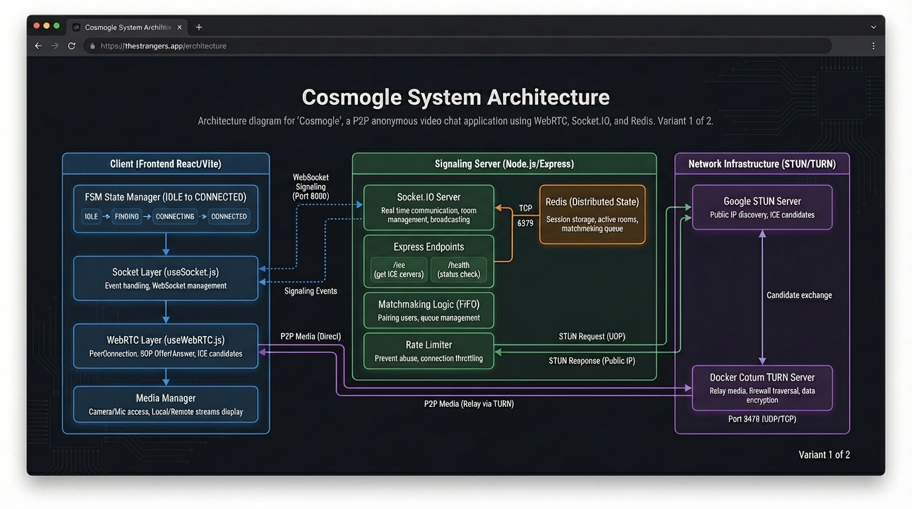

# cosmogle

cosmogle is a chill random video chat app where you can connect face-to-face with total strangers — no accounts, no drama, just hit “start” and vibe. It’s like Omegle, but self-built, using WebRTC and Socket.IO to handle real-time video, audio, and text chat smoothly.

The app is still in development and there’s plenty of room for improvement, but the core idea is already live. It’s an open project — anyone’s welcome to contribute!


# logo


# Arquitectura


# Conexion


Este proyecto utiliza las siguientes tecnologías:

## 🛠️ Tecnologías Stack
-  **JavaScript**
-  **Node.js**
-  **Socket.io**
-  **WebRTC**
-  **REACT**
-  **TailwindCSS**
-  **Express.js**
-  **Docker**

## Configuración del entorno


## Clonar repositorio
```
$ git clone https://github.com/loredounipass/Strangers
```
$ cd Strangers
```

## Iniciar Frontend

```bash
$ cd client
$ pnpm install
$ pnpm run dev
```

## Iniciar Backend

```bash
$ cd server
$ pnpm install
$ pnpm run dev
```

## Welcome page


## Inicio page


## Video page

